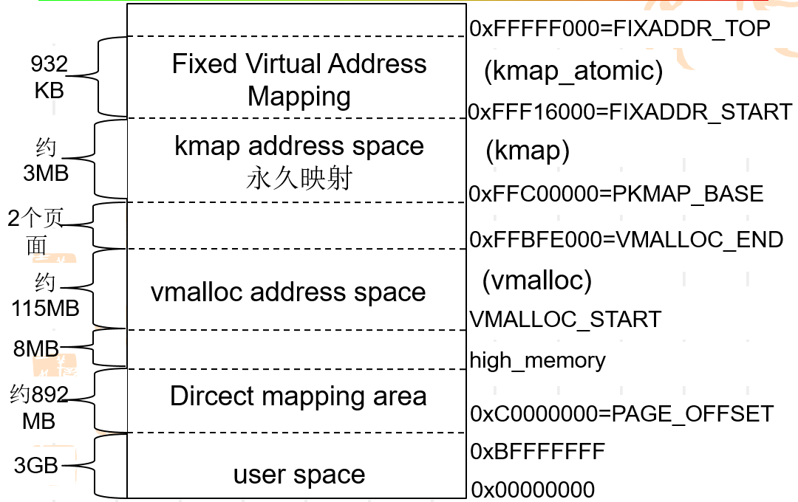
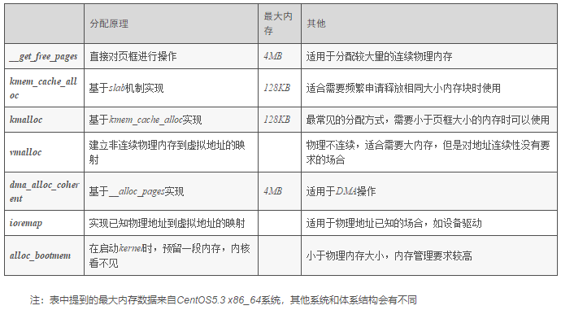

<!-- TOC depthFrom:1 depthTo:6 withLinks:1 updateOnSave:1 orderedList:0 -->

- [Linux内核面试300题](#linux内核面试300题)
	- [基本概念](#基本概念)
		- [Linux中的用户模式和内核模式是什么含意？](#linux中的用户模式和内核模式是什么含意)
	- [内存管理](#内存管理)
		- [怎样申请大块内核内存？](#怎样申请大块内核内存)
		- [通过伙伴系统申请内核内存的函数有哪些？](#通过伙伴系统申请内核内存的函数有哪些)
			- [多级分页目录结构](#多级分页目录结构)
			- [伙伴系统算法](#伙伴系统算法)
			- [slab分配器](#slab分配器)
			- [常用内存分配函数](#常用内存分配函数)
			- [几种分配函数的比较](#几种分配函数的比较)
		- [通过slab分配器申请内核内存的函数有？](#通过slab分配器申请内核内存的函数有)
		- [Linux的内核空间和用户空间是如何划分的（以32位系统为例）？](#linux的内核空间和用户空间是如何划分的以32位系统为例)
		- [vmalloc()申请的内存有什么特点？](#vmalloc申请的内存有什么特点)
		- [用户程序使用malloc()申请到的内存空间在什么范围？](#用户程序使用malloc申请到的内存空间在什么范围)
		- [在支持并使能MMU的系统中，Linux内核和用户程序分别运行在物理地址模式还是虚拟地址模式？](#在支持并使能mmu的系统中linux内核和用户程序分别运行在物理地址模式还是虚拟地址模式)
		- [ARM处理器是通过几级也表进行存储空间映射的？](#arm处理器是通过几级也表进行存储空间映射的)
		- [TLB中缓存的是什么内容？](#tlb中缓存的是什么内容)
	- [同步机制](#同步机制)
		- [Linux中主要有哪几种内核锁？](#linux中主要有哪几种内核锁)
	- [进程间通信](#进程间通信)
		- [用户进程间通信主要哪几种方式？](#用户进程间通信主要哪几种方式)
	- [文件系统](#文件系统)
		- [Linux是通过什么组件来实现支持多种文件系统的？](#linux是通过什么组件来实现支持多种文件系统的)
		- [Linux虚拟文件系统的关键数据结构有哪些？（至少写出四个）](#linux虚拟文件系统的关键数据结构有哪些至少写出四个)
		- [对文件或设备的操作函数保存在那个数据结构中？](#对文件或设备的操作函数保存在那个数据结构中)
		- [Linux中的文件包括哪些？](#linux中的文件包括哪些)
	- [进程管理](#进程管理)
		- [创建进程的系统调用有那些？](#创建进程的系统调用有那些)
		- [调用schedule()进行进程切换的方式有几种？](#调用schedule进行进程切换的方式有几种)
		- [Linux调度程序是根据进程的动态优先级还是静态优先级来调度进程的？](#linux调度程序是根据进程的动态优先级还是静态优先级来调度进程的)
		- [进程调度的核心数据结构是哪个？](#进程调度的核心数据结构是哪个)
	- [内核模块](#内核模块)
		- [如何加载、卸载一个模块？](#如何加载卸载一个模块)
		- [模块和应用程序分别运行在什么空间？](#模块和应用程序分别运行在什么空间)
		- [模块程序能否使用可链接的库函数？](#模块程序能否使用可链接的库函数)
	- [Linux浮点运算](#linux浮点运算)
		- [Linux中的浮点运算由应用程序实现还是内核实现？](#linux中的浮点运算由应用程序实现还是内核实现)
	- [设备管理](#设备管理)
		- [Linux中有哪几种设备？](#linux中有哪几种设备)
		- [字符设备驱动程序的关键数据结构是哪个？](#字符设备驱动程序的关键数据结构是哪个)
		- [设备驱动程序包括哪些功能函数？](#设备驱动程序包括哪些功能函数)
		- [如何唯一标识一个设备？](#如何唯一标识一个设备)
	- [中断异常和系统调用](#中断异常和系统调用)
		- [Linux通过什么方式实现系统调用？](#linux通过什么方式实现系统调用)
		- [Linux软中断和工作队列的作用是什么？](#linux软中断和工作队列的作用是什么)
	- [END](#end)

<!-- /TOC -->
# Linux内核面试300题


## 基本概念

### Linux中的用户模式和内核模式是什么含意？

```
MS-DOS等操作系统在单一的CPU模式下运行，但是一些类Unix的操作系统则使用了双模式，可以有效地实现时间共享。在Linux机器上，CPU要么处于受信任的内核模式，要么处于受限制的用户模式。除了内核本身处于内核模式以外，所有的用户进程都运行在用户模式之中。

内核模式的代码可以无限制地访问所有处理器指令集以及全部内存和I/O空间。如果用户模式的进程要享有此特权，它必须通过系统调用向设备驱动程序或其他内核模式的代码发出请求。另外，用户模式的代码允许发生缺页，而内核模式的代码则不允许。

在2.4和更早的内核中，仅仅用户模式的进程可以被上下文切换出局，由其他进程抢占。除非发生以下两种情况，否则内核模式代码可以一直独占CPU：
(1) 它自愿放弃CPU；
(2) 发生中断或异常。
**2.6内核引入了内核抢占，大多数内核模式的代码也可以被抢占。**
```

## 内存管理

### 怎样申请大块内核内存？

在Linux内核环境下，申请大块内存的成功率随着系统运行时间的增加而减少，虽然可以通过vmalloc系列调用申请物理不连续但虚拟地址连续的内存，但毕竟其使用效率不高且在32位系统上vmalloc的内存地址空间有限。所以，一般的建议是在系统启动阶段申请大块内存，但是其成功的概率也只是比较高而已，而不是100%。如果程序真的比较在意这个申请的成功与否，只能退用“启动内存”（Boot Memory）。下面就是申请并导出启动内存的一段示例代码：
```
void* x_bootmem = NULL;
EXPORT_SYMBOL(x_bootmem);

unsigned long x_bootmem_size = 0;
EXPORT_SYMBOL(x_bootmem_size);

static int __init x_bootmem_setup(char *str)
{
        x_bootmem_size = memparse(str, &str);
        x_bootmem = alloc_bootmem(x_bootmem_size);
        printk("Reserved %lu bytes from %p for x\n", x_bootmem_size, x_bootmem);

        return 1;
}
__setup("x-bootmem=", x_bootmem_setup);
```
可见其应用还是比较简单的，不过利弊总是共生的，它不可避免也有其自身的限制：

1. 内存申请代码只能连接进内核，不能在模块中使用。
2. 被申请的内存不会被页分配器和slab分配器所使用和统计，也就是说它处于系统的可见内存之外，即使在将来的某个地方你释放了它。
3. 一般用户只会申请一大块内存，如果需要在其上实现复杂的内存管理则需要自己实现。
4. 在不允许内存分配失败的场合，通过启动内存预留内存空间将是我们唯一的选择。

### 通过伙伴系统申请内核内存的函数有哪些？

在物理页面管理上实现了**基于区的伙伴系统（zone based buddy system）**。对不同区的内存使用单独的伙伴系统(buddy system)管理,而且独立地监控空闲页。相应接口**alloc_pages(gfp_mask, order)**,**_get_free_pages(gfp_mask, order)**等。

补充知识：

1.原理说明


#### 多级分页目录结构

Linux内核中采 用了一种同时适用于32位和64位系统的内存分页模型，对于32位系统来说，两级页表足够用了，而在x86_64系统中，用到了四级页表。
```
* 页全局目录(Page Global Directory)
* 页上级目录(Page Upper Directory)
* 页中间目录(Page Middle Directory)
* 页表(Page Table)
```

页全局目录包含若干页上级目录的地址，页上级目录又依次包含若干页中间目录的地址，而页中间目录又包含若干页表的地址，每一个页表项指 向一个页框。Linux中采用4KB大小的 页框作为标准的内存分配单元。

　　

#### 伙伴系统算法

在实际应用中，经常需要分配一组连续的页框，而频繁地申请和释放不同大小的连续页框，必然导致在已分配页框的内存块中分散了许多小块的 空闲页框。这样，即使这些页框是空闲的，其他需要分配连续页框的应用也很难得到满足。

为了避免出现这种情况，Linux内核中引入了**伙伴系统算法(buddy system)**。**把所有的空闲页框分组为11个 块链表，每个块链表分别包含大小为1，2，4，8，16，32，64，128，256，512和1024个连续页框的页框块。最大可以申请1024个连 续页框，对应4MB大小的连续内存。每个页框块的第一个页框的物理地址是该块大小的整数倍。**

假设要申请一个256个页框的块，先从256个页框的链表中查找空闲块，如果没有，就去512个 页框的链表中找，找到了则将页框块分为2个256个页框的块，一个分配给应用，另外一个移到256个页框的链表中。如果512个页框的链表中仍没有空闲块，继续向1024个页 框的链表查找，如果仍然没有，则返回错误。

**页框块在释放时，会主动将两个连续的页框块合并为一个较大的页框块。**

#### slab分配器

slab分配器源于 Solaris 2.4 的分配算法，工作于物理内存页框分配器之上，管理特定大小对象的缓存，进行快速而高效的内存分配。

slab分配器为每种使用的内核对象建立单独的缓冲区。Linux 内核已经采用了伙伴系统管理物理内存页框，因此 slab分配器直接工作于伙伴系统之上。**每种缓冲区由多个slab 组成，每个slab就是一组连续的物理内存页框，被划分成了固定数目的对象。根据对象大小的不同，缺省情况下一个slab最多可以由1024个页框构成。出于对齐等其它方面的要求，slab中分配给对象的内存可能大于用户要求的对象实际大小，这会造成一定的内存浪费。**

#### 常用内存分配函数
```
** __get_free_pages

unsigned long __get_free_pages(gfp_t gfp_mask, unsigned int order)
```
__get_free_pages函数是最原始的内存分配方式，直接从伙伴系统中获取原始页框，返回值为第一个页框的起始地址。__get_free_pages在实现上只是封装了alloc_pages函数，从代码分析，alloc_pages函数会分配长度为1<<order的连续页框块。order参数的最大值由include/linux/Mmzone.h文件中的MAX_ORDER宏决定，在默认的2.6.18内核版本中，该宏定义为10。也就是说在理论上__get_free_pages函数一次最多能申请1<<10 * 4KB也就是4MB的连续物理内存。但是在实际应用中，很可能因为不存在这么大量的连续空闲页框而导致分配失败。在测试中，order为10时分配成功，order为11则返回错误。

```
** kmem_cache_alloc

struct kmem_cache *kmem_cache_create(const char *name, size_t size,

size_t align, unsigned long flags,

void (*ctor)(void*, struct kmem_cache *, unsigned long),

void (*dtor)(void*, struct kmem_cache *, unsigned long))

void *kmem_cache_alloc(struct kmem_cache *c, gfp_t flags)
```

kmem_cache_create/ kmem_cache_alloc是基于slab分配器的一种内存分配方式，适用于反复分配释放同一大小内存块的场合。首先用kmem_cache_create创建一个高速缓存区域，然后用kmem_cache_alloc从该高速缓存区域中获取新的内存块。kmem_cache_alloc一次能分配的最大内存由mm/slab.c文件中的MAX_OBJ_ORDER宏定义，在默认的2.6.18内核版本中，该宏定义为5， 于是一次最多能申请1<<5*4KB也就是128KB的连续物理内存。分析内核源码发现，kmem_cache_create函数的size参数大于128KB时会调用BUG()。测试结果验证了分析结果，用kmem_cache_create分配超过128KB的内存时使内核崩溃。

```
** kmalloc

void *kmalloc(size_t size, gfp_t flags)
```

kmalloc是内核中最常用的一种内存分配方式，它通过调用kmem_cache_alloc函数来实现。kmalloc一次最多能申请的内存大小由include/linux/Kmalloc_size.h的 内容来决定，在默认的2.6.18内核版本中，kmalloc一次最多能申请大小为131702B也就是128KB字节的连续物理内存。测试结果表明，如果试图用kmalloc函数分配大于128KB的内存，编译不能通过。

```
** vmalloc

void *vmalloc(unsigned long size)
```

前面几种内存分配方式都是物理连续的，能保证较低的平均访问时间。但是在某些场合中，对内存区的请求不是很频繁，较高的内存访问时间也可以接受，这是就可以分配一段线性连续，物理不连续的地址，带来的好处是一次可以分配较大块的内存。图3-1表示的是vmalloc分配的内存使用的地址范围。vmalloc对 一次能分配的内存大小没有明确限制。出于性能考虑，应谨慎使用vmalloc函数。在测试过程中，最大能一次分配1GB的空间。




```
** dma_alloc_coherent

void *dma_alloc_coherent(struct device *dev, size_t size,ma_addr_t *dma_handle, gfp_t gfp)
```

DMA是一种硬件机制，允许外围设备和主存之间直接传输IO数据，而不需要CPU的参与，使用DMA机制能大幅提高与设备通信的 吞吐量。DMA操作中，涉及到CPU高速缓存和对应的内存数据一致性的问题，必须保证两者的数据一致，在x86_64体系结构中，硬件已经很好的解决了这个问题。
dma_alloc_coherent和__get_free_pages函数实现差别不大，前者实际是调用__alloc_pages函数来分配内存，因此一次分配内存的大小限制和后者一样。__get_free_pages分配的内存同样可以用于DMA操作。测试结果证明，dma_alloc_coherent函数一次能分配的最大内存也为4M。

```
** ioremap

void * ioremap (unsigned long offset, unsigned long size)
```

ioremap是一种更直接的内存“分配”方式，使用时直接指定物理起始地址和需要分配内存的大小，然后将该段物理地址映射到内核地址空间。ioremap用到的物理地址空间都是事先确定的，和上面的几种内存分配方式并不太一样，并不是分配一段新的物理内存。ioremap多用于设备驱动，可以让CPU直接访问外部设备的IO空间。ioremap能映射的内存由原有的物理内存空间决定，所以没有进行测试。

```
** Boot Memory

void* alloc_bootmem(unsigned long size)
```
如果要分配大量的连续物理内存，上述的分配函数都不能满足，就只能用比较特殊的方式，在Linux内核引导阶段来预留部分内存。

可以在Linux内核引导过程中绕过伙伴系统来分配大块内存。使用方法是在Linux内核引导时，调用mem_init函数之前 用alloc_bootmem函数申请指定大小的内存。如果需要在其他地方调用这块内存，可以将alloc_bootmem返回的内存首地址通过EXPORT_SYMBOL导出，然后就可以使用这块内存了。这种内存分配方式的缺点是，申请内存的代码必须在链接到内核中的代码里才能使用，因此必须重新编译内核，而且内存管理系统看不到这部分内存，需要用户自行管理。测试结果表明，重新编译内核后重启，能够访问引导时分配的内存块。

```
通过内核引导参数预留顶部内存

/boot/grub/grub.conf中内核启动引导参数

mem #指定kernel使用的内存量，mem=n[KMG]
```
在Linux内核引导时，传入参数“mem=size”保留顶部的内存区间。**比如系统有256MB内 存，参数“mem=248M”会预留顶部的8MB内存，进入系统后可以调用ioremap(0xF800000，0x800000)来申请这段内存。**

#### 几种分配函数的比较




### 通过slab分配器申请内核内存的函数有？
### Linux的内核空间和用户空间是如何划分的（以32位系统为例）？
### vmalloc()申请的内存有什么特点？
### 用户程序使用malloc()申请到的内存空间在什么范围？
### 在支持并使能MMU的系统中，Linux内核和用户程序分别运行在物理地址模式还是虚拟地址模式？
### ARM处理器是通过几级也表进行存储空间映射的？
### TLB中缓存的是什么内容？


## 同步机制

### Linux中主要有哪几种内核锁？

**Linux的内核锁主要是自旋锁和信号量。**

自旋锁最多只能被一个可执行线程持有，如果一个执行线程试图请求一个已被争用（已经被持有）的自旋锁，那么这个线程就会一直进行忙循环——旋转——等待锁重新可用。要是锁未被争用，请求它的执行线程便能立刻得到它并且继续进行。**自旋锁可以在任何时刻防止多于一个的执行线程同时进入临界区。**

Linux中的信号量是一种睡眠锁。**如果有一个任务试图获得一个已被持有的信号量时，信号量会将其推入等待队列，然后让其睡眠。**这时处理器获得自由去执行其它代码。当持有信号量的进程将信号量释放后，在等待队列中的一个任务将被唤醒，从而便可以获得这个信号量。

**信号量的睡眠特性，使得信号量适用于锁会被长时间持有的情况**；只能在进程上下文中使用，因为中断上下文中是不能被调度的；另外**当代码持有信号量时，不可以再持有自旋锁。**


## 进程间通信

### 用户进程间通信主要哪几种方式？

```
（1）管道（Pipe）：管道可用于具有亲缘关系进程间的通信，允许一个进程和另一个与它有共同祖先的进程之间进行通信。

（2）命名管道（named pipe）：命名管道克服了管道没有名字的限制，因此，除具有管道所具有的功能外，它还允许无亲缘关系进程间的通信。命名管道在文件系统中有对应的文件名。命名管道通过命令mkfifo或系统调用mkfifo来创建。

（3）信号（Signal）：信号是比较复杂的通信方式，用于通知接受进程有某种事件发生，除了用于进程间通信外，进程还可以发送信号给进程本身；linux除了支持Unix早期信号语义函数sigal外，还支持语义符合Posix.1标准的信号函数sigaction（实际上，该函数是基于BSD的，BSD为了实现可靠信号机制，又能够统一对外接口，用sigaction函数重新实现了signal函数）。

（4）消息（Message）队列：消息队列是消息的链接表，包括Posix消息队列system V消息队列。有足够权限的进程可以向队列中添加消息，被赋予读权限的进程则可以读走队列中的消息。消息队列克服了信号承载信息量少，管道只能承载无格式字节流以及缓冲区大小受限等缺

（5）共享内存：使得多个进程可以访问同一块内存空间，是最快的可用IPC形式。是针对其他通信机制运行效率较低而设计的。往往与其它通信机制，如信号量结合使用，来达到进程间的同步及互斥。

（6）信号量（semaphore）：主要作为进程间以及同一进程不同线程之间的同步手段。

（7）套接字（Socket）：更为一般的进程间通信机制，可用于不同机器之间的进程间通信。起初是由Unix系统的BSD分支开发出来的，但现在一般可以移植到其它类Unix系统上：Linux和System V的变种都支持套接字。
```


## 文件系统

### Linux是通过什么组件来实现支持多种文件系统的？
### Linux虚拟文件系统的关键数据结构有哪些？（至少写出四个）
### 对文件或设备的操作函数保存在那个数据结构中？
###  Linux中的文件包括哪些？

## 进程管理

### 创建进程的系统调用有那些？
### 调用schedule()进行进程切换的方式有几种？
### Linux调度程序是根据进程的动态优先级还是静态优先级来调度进程的？
### 进程调度的核心数据结构是哪个？

## 内核模块

### 如何加载、卸载一个模块？
### 模块和应用程序分别运行在什么空间？
### 模块程序能否使用可链接的库函数？

## Linux浮点运算

### Linux中的浮点运算由应用程序实现还是内核实现？


## 设备管理

### Linux中有哪几种设备？
### 字符设备驱动程序的关键数据结构是哪个？
### 设备驱动程序包括哪些功能函数？
### 如何唯一标识一个设备？


## 中断异常和系统调用

### Linux通过什么方式实现系统调用？
### Linux软中断和工作队列的作用是什么？


## END
